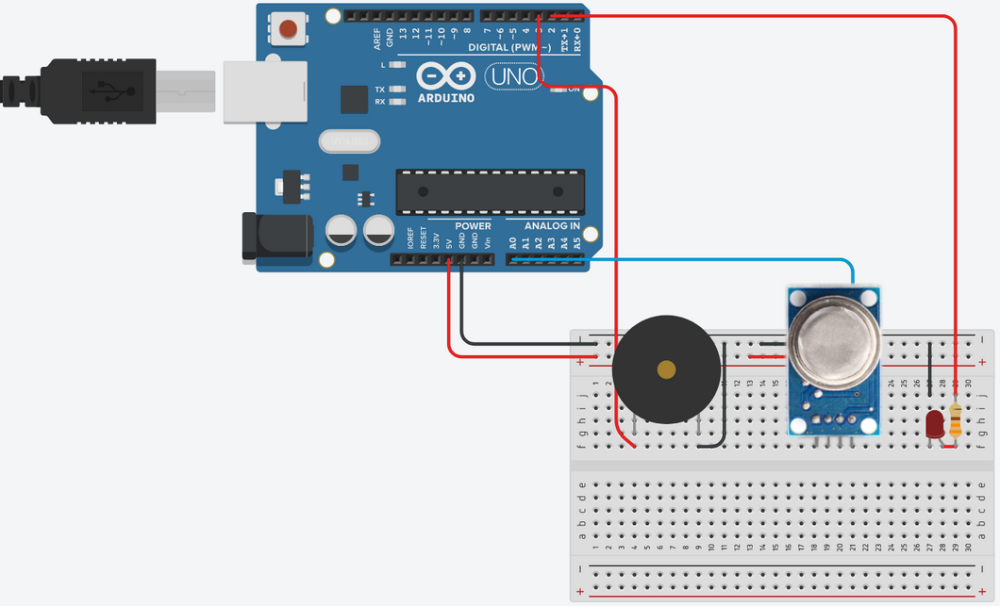

# Sistema de Sensor de Gas con Arduino

## General Info

System developed in Arduino and Visual Studio. The system is capable of reading the air quality with the help of an MQ-5 gas sensor and based on this it generates a graph in real time and can also warn by means of an LED and a Buzzer if it is in danger or if it should be to take precautions.

## Installation

You can follow the next command lines to **build the Windows Forms Application**.

```
$ git clone https://github.com/Santana-C/SensorGasArduino
$ dotnet build
```
And **compile the arduino code** to the Arduino board too.

The arduino code is in arduino-project folder.

## Arduino Circuit

Follow the next circuit



## Tecnologies
* [Visual Studio](https://visualstudio.microsoft.com/es/thank-you-downloading-visual-studio/?sku=Community&rel=17): Version 2022

* [Arduino IDE](https://www.arduino.cc/en/software): Version 1.8.16

* [Arduino UNO](https://store.arduino.cc/products/arduino-uno-rev3/): Rev3

